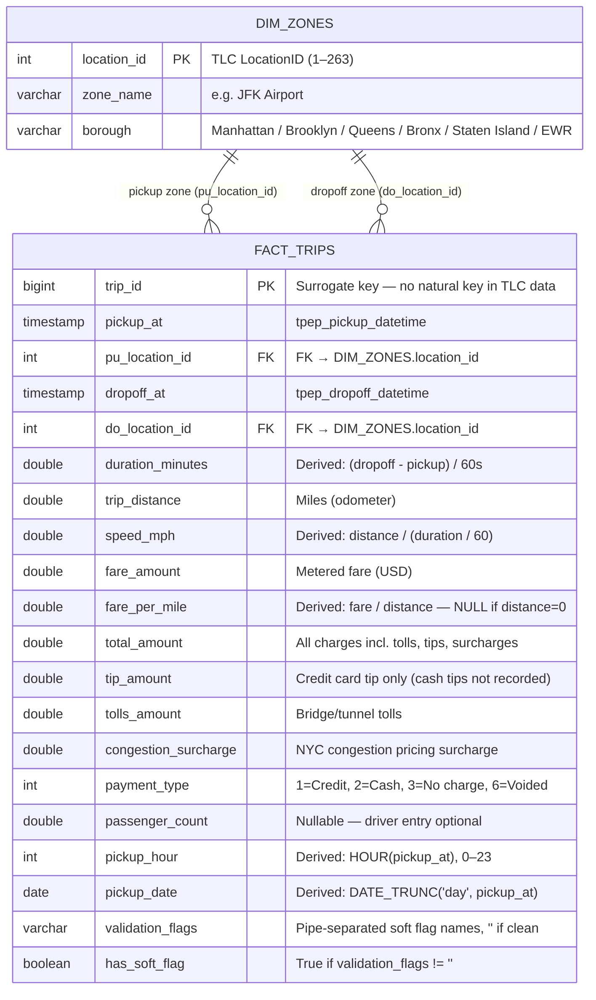

# Data Model — NYC TLC Reliability & Efficiency Pipeline

> **Class 7 deliverable.** Entity-relationship model + event sequence for the fact/dimension
> schema built in `src/model.py` (DuckDB in-memory). PNG rendered in final polish phase.

---

## Entity-Relationship Diagram



---

## Event Sequence

The TLC trip lifecycle has 4 logical states. Only 3 are observable in the data:

| State | Observable? | Columns in fact table | Notes |
|---|---|---|---|
| **1. Request** (hail / dispatch) | ❌ **NOT RECORDED** | — | TLC does not capture the hail/dispatch moment for yellow taxis. This gap means we cannot compute wait time or request-to-pickup latency. **Documented as a Limitation in the validation report KUAL.** |
| **2. Pickup** | ✅ Yes | `pickup_at`, `pu_location_id`, `pickup_hour`, `pickup_date` | The metered trip starts here. |
| **3. Dropoff** | ✅ Yes | `dropoff_at`, `do_location_id`, `duration_minutes`, `speed_mph` | The metered trip ends here. Distance and duration are computable. |
| **4. Payment** | ✅ Yes | `payment_type`, `fare_amount`, `fare_per_mile`, `tip_amount`, `total_amount` | Settlement recorded by the vendor system. Cash tips not captured. |

---

## Enriched View: `fact_trips_enriched`

The core analytic view joins both zone dimensions onto the fact table:

```sql
CREATE VIEW fact_trips_enriched AS
SELECT
    t.*,
    pu.zone_name  AS pu_zone,
    pu.borough    AS pu_borough,
    do_.zone_name AS do_zone,
    do_.borough   AS do_borough
FROM fact_trips t
LEFT JOIN dim_zones pu  ON t.pu_location_id = pu.location_id
LEFT JOIN dim_zones do_ ON t.do_location_id = do_.location_id;
```

**Why LEFT JOIN?** Valid trips that passed all hard rules have LocationIDs in the zone lookup
(location_unknown and location_invalid are both hard rules). LEFT JOIN is used defensively so
a previously-unseen zone ID edge case surfaces as NULL in query results rather than silently
dropping rows from metric aggregations.

---

## KPI Metric → Model Mapping

| Metric | Source | Key columns / aggregation |
|---|---|---|
| **M1 Data Reliability %** | Validation report JSON | `rows_valid / rows_raw × 100` |
| **M2 Median Duration** | `fact_trips_enriched` | `MEDIAN(duration_minutes) GROUP BY pu_borough, pickup_hour` |
| **M3 Median Speed** | `fact_trips_enriched` | `MEDIAN(speed_mph) GROUP BY pu_borough, pickup_hour` |
| **M4 Fare-per-Mile Consistency** | `fact_trips_enriched` | `AVG(fare_per_mile), STDDEV_SAMP(fare_per_mile), outlier_pct GROUP BY pu_borough` |
| **M5 Anomaly Rate %** | Validation report JSON | `(hard_flagged + soft_only_flagged) / rows_raw × 100` |

---

## FDE Judgement Calls (Model)

| Decision | Rationale |
|---|---|
| In-memory DuckDB (no `.duckdb` file) | Pipeline output is the CSVs, not the database. In-memory = perfectly idempotent; no stale DB file that could drift from pipeline behaviour. |
| Borough × hour aggregation for M2/M3 | 263 zones × 24 hours = 6,312 rows with one month of data, producing many low-n zone-hours with noisy medians. Borough × hour (120 rows) is the actionable operational granularity. Zone-hour provided as supplementary CSV. |
| Surrogate `trip_id` (ROW_NUMBER) | TLC provides no natural primary key for trip records. Surrogate avoids downstream join issues. |
| LEFT JOIN on zone dimension | Defensive — surfaces NULL zone matches as visible anomalies rather than silently dropping rows from aggregations. |

---
*Mermaid ER diagram rendered natively by GitHub. Fact/dimension relational model implemented in `src/model.py`.*
